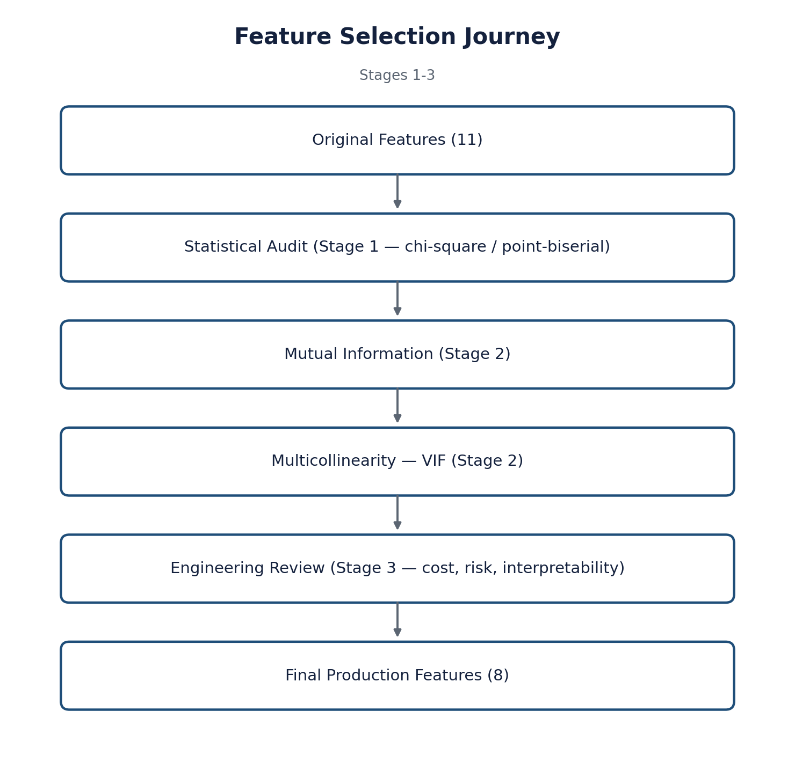
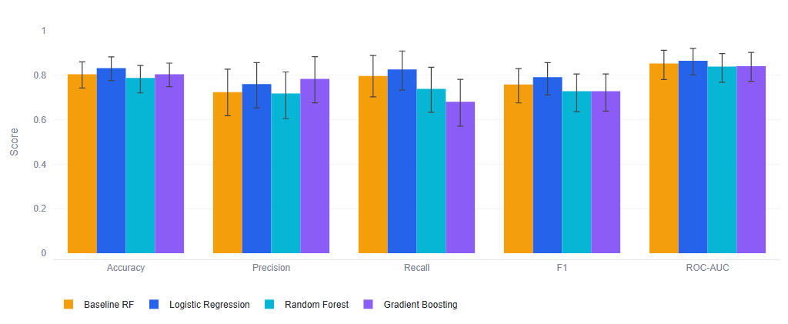
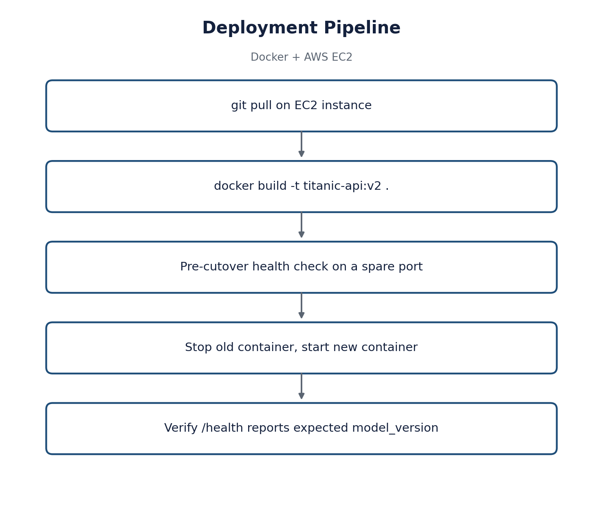
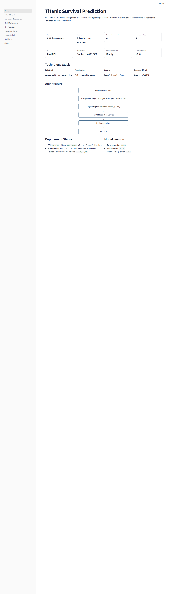
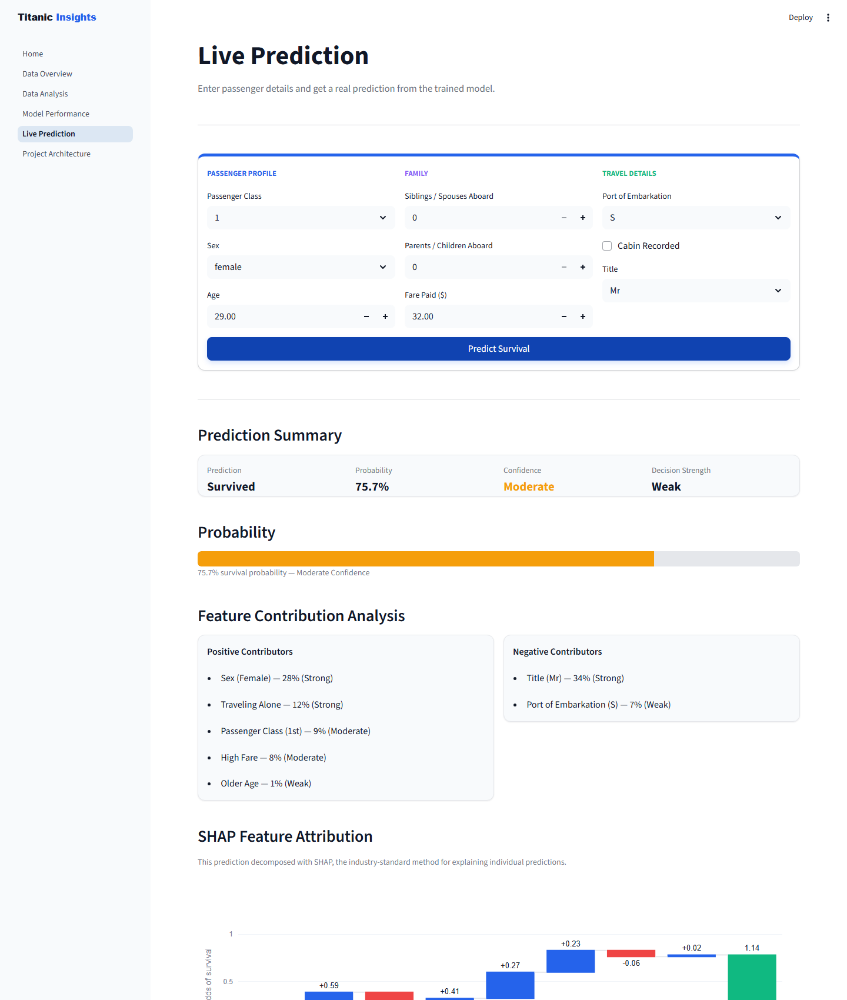
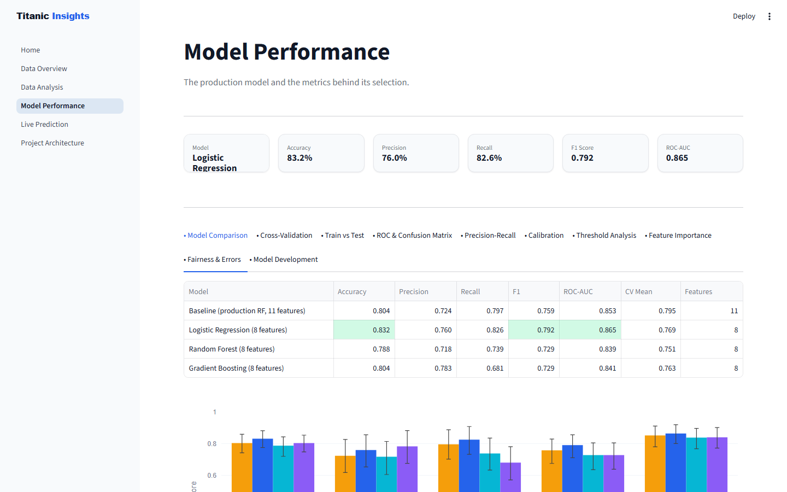
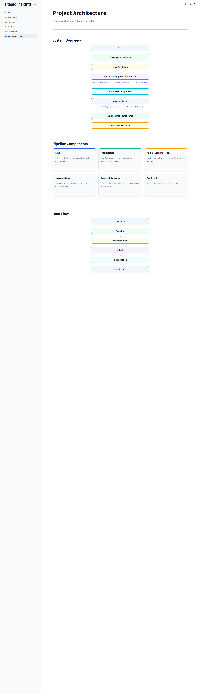
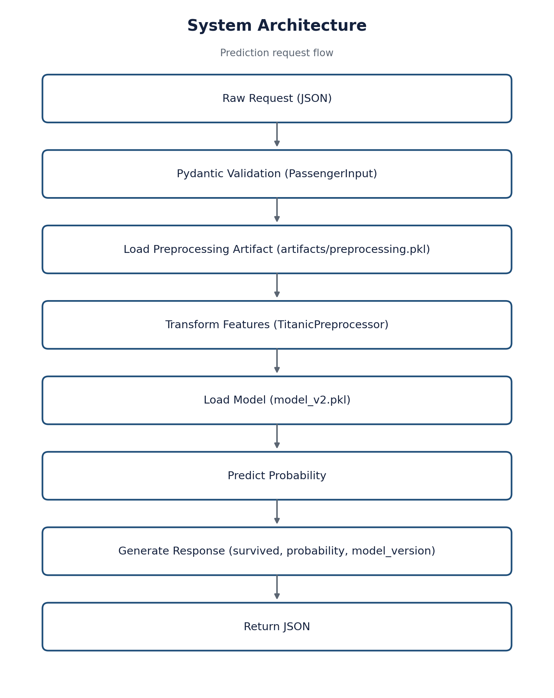
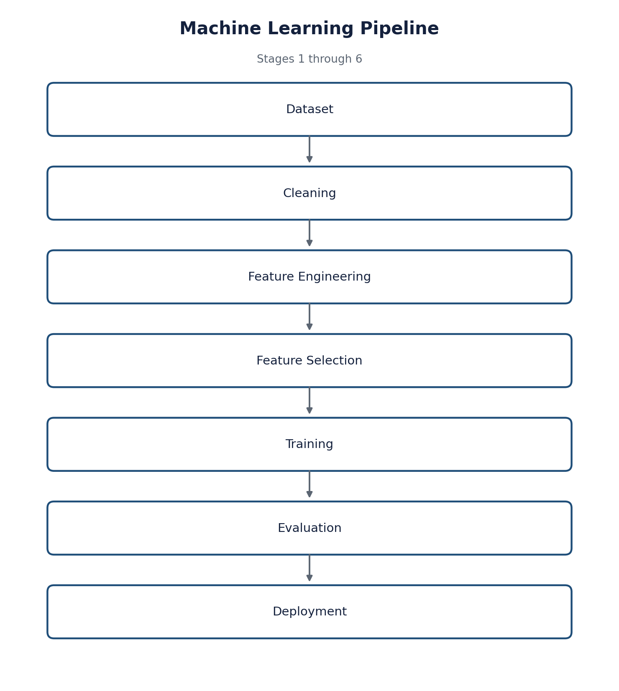

<div align="center">

# Titanic Survival Prediction

**A production-grade machine learning system — not a Kaggle notebook.**

Leakage-safe preprocessing, a statistically-validated feature schema, a controlled four-model comparison, an explainable production model, a versioned deployment pipeline, and a tested, CI-gated codebase.


</div>

---

> [!NOTE]
> **🌐 Live on AWS EC2:**
> - Interactive Streamlit Dashboard: **http://13.51.85.67:8501**
> - FastAPI Production Web Service: **http://13.51.85.67:8000/docs**

## 🚢 Project Overview

This project predicts Titanic passenger survival — but the dataset is the
vehicle, not the point. It exists to demonstrate a full ML engineering
lifecycle: a leakage-safe preprocessing pipeline, a production feature
schema chosen by VIF and mutual-information evidence rather than
intuition, a controlled comparison across four models, and a deployment
plan that upgrades the model without breaking the live API. The system
ships as a versioned FastAPI service, a 6-page Streamlit dashboard, and
a Docker/EC2 deployment path, backed by 76 automated tests and a CI
pipeline that rebuilds and validates every artifact on every push.

## ✨ Features

- **Data-leakage protection** — `TitanicPreprocessor` fits imputation and encoding on the training split only; a regression test proves the original full-dataset-fit bug can't recur.
- **Stratified 5-fold cross-validation** — every one of the four candidate models is trained and scored under one identical split and CV protocol, not tuned unevenly and cherry-picked.
- **Statistical feature selection** — VIF and mutual information cut the schema from 11 features to 8, evidence-based rather than intuition-based.
- **Model explainability, no SHAP dependency** — Logistic Regression's own coefficients decompose into signed, per-feature contributions for any single passenger.
- **Interactive Streamlit dashboard** — 6 pages covering data exploration, statistical analysis, model comparison, and a live decision-support prediction tool, with collapsible "What This Means" explanations on every major chart.
- **FastAPI endpoint service** — Pydantic-validated `/predict`, `/v2/predict`, and `/health` endpoints, with a request/response contract that stayed backward-compatible through a full model and schema swap.
- **Dockerized deployment** — a single versioned image, deployed to AWS EC2, with a documented rollback runbook.

## 📦 Project Structure

```
Titanic-End-to-End/
├── analysis/          Reproducible stage scripts (data audit, model comparison)
├── api/               FastAPI service — schemas.py, main.py
├── artifacts/         Versioned preprocessing + feature schema
├── dashboard/         6-page Streamlit application
├── docs/              Diagrams and dashboard screenshots (this README's assets)
├── data/              Raw Titanic dataset
├── model/             model_v1.pkl, model_v2.pkl, train.py, train_v2.py
├── notebooks/         Stage 2 (EDA), Stage 4 (comparison), Stage 5 (evaluation) notebooks
├── reports/           Stage-by-stage engineering write-ups
├── src/               TitanicPreprocessor — shared feature engineering
├── tests/             unit/, integration/, e2e/ — 76 tests
├── .github/workflows/ CI pipeline
└── Dockerfile
```

## ⚙️ Data Preprocessing & Pipeline

- **Train/test split** — an 80/20 stratified split, identical across all four compared models.
- **Imputation** — `Age` is filled from the training fold's own statistics, never the full dataset; `Embarked` is filled from the training fold's mode.
- **Cabin** — 77% missing, too sparse to impute reliably, so it's converted to a binary `HasCabin` flag instead of being dropped outright.
- **Feature engineering** — `FamilySize` is derived from `SibSp + Parch`; `Title` is extracted from `Name` (Mr / Mrs / Miss / Master / Rare).
- **Skew correction** — `Fare` is heavily right-skewed, so it's log-transformed before reaching the model.
- **Multicollinearity** — VIF flagged `SibSp`, `Parch`, and `FamilySize` as perfectly collinear (VIF = infinite); only `FamilySize` was kept in the production schema.
- **Encoding & scaling** — categorical features go through a `ColumnTransformer` inside the same pipeline object that's persisted and versioned — nothing is transformed by hand outside the pipeline.

Full write-up: [`reports/stage3_feature_selection.md`](reports/stage3_feature_selection.md).

<div align="center">

</div>

## 🔬 Model Experimentation & Metrics

Four models, one identical split, cross-validation strategy, and evaluation protocol:

| Model | Accuracy | Precision | Recall | F1 | ROC-AUC | CV Mean (F1) | Features |
|---|---|---|---|---|---|---|---|
| **Logistic Regression (production)** | **0.832** | **0.760** | **0.826** | **0.792** | **0.865** | 0.769 | **8** |
| Baseline Random Forest (previous production, tuned) | 0.804 | 0.724 | 0.797 | 0.759 | 0.853 | **0.795** | 11 |
| Gradient Boosting | 0.804 | 0.783 | 0.681 | 0.729 | 0.841 | 0.763 | 8 |
| Random Forest (untuned, new schema) | 0.788 | 0.718 | 0.739 | 0.729 | 0.839 | 0.751 | 8 |

<div align="center">

</div>

**Rationale for Logistic Regression selection:**

- **Best on 4 of 5 test metrics** — accuracy, recall, F1, and ROC-AUC — against a tuned baseline, without any hyperparameter search of its own.
- **No overfitting signature** — the only model whose test F1 doesn't drop below its train F1; Random Forest's train/test F1 gap is +0.255.
- **Faster** — trains in a fraction of a second versus the baseline's tuned RandomizedSearchCV, and predicts faster too.
- **Fully interpretable** — every prediction decomposes into signed, per-feature coefficient contributions, no black box.

Full controlled-comparison methodology: [`reports/stage4_model_comparison.md`](reports/stage4_model_comparison.md).

## 🚀 Installation & Local Run

```bash
# Clone the repository
git clone https://github.com/Udbhav748/Titanic_ML_Project.git
cd Titanic-End-to-End

# Install dependencies
pip install -r requirements-dev.txt
```

```bash
# Run the Streamlit dashboard
streamlit run dashboard/Home.py
```

Open http://localhost:8501 in your browser, or try the
[live dashboard](http://13.51.85.67:8501) directly.

## ⚡ FastAPI Production Web Service

```bash
# Run the API locally
uvicorn api.main:app --reload
```

Interactive docs are served at `/docs`, or try the
[live instance](http://13.51.85.67:8000/docs) directly.

**Request** — `POST /predict`

```bash
curl -X POST http://localhost:8000/predict \
  -H "Content-Type: application/json" \
  -d '{
        "pclass": 1, "sex": "female", "age": 29,
        "sibsp": 0, "parch": 0, "fare": 100,
        "embarked": "C", "has_cabin": true, "title": "Mrs"
      }'
```

**Response:**

```json
{"survived": true, "survival_probability": 0.9867}
```

## 🐳 Docker Deployment

```bash
# Build the image
docker build -t titanic-api .

# Run the container
docker run -d -p 8000:8000 --name titanic-api-container titanic-api
```

<div align="center">

</div>

Full request-to-response trace and EC2 rollback runbook:
[`reports/stage6_deployment_plan.md`](reports/stage6_deployment_plan.md).

## Dashboard Preview

<table>
<tr>
<td width="50%"><br><sub align="center">Home</sub></td>
<td width="50%"><br><sub>Live Prediction</sub></td>
</tr>
<tr>
<td width="50%"><br><sub>Model Performance</sub></td>
<td width="50%"><br><sub>Project Architecture</sub></td>
</tr>
</table>

6 pages: Home, Data Overview, Data Analysis, Model Performance, Live
Prediction, Project Architecture. Every chart and metric is computed
live from the versioned artifacts — nothing is hardcoded. Every major
chart carries a collapsed "What This Means" panel: what the chart shows,
why it matters, and what engineering decision it drove. Live Prediction
decomposes a single passenger's prediction into signed feature
contributions, counterfactuals, and similar historical cases, all
computed from the model's own coefficients.

## System Architecture

<div align="center">

</div>

Both the preprocessing artifact and the model load once at process
startup — never refit, never reloaded per request.

## Machine Learning Pipeline

<div align="center">

</div>

Each stage is a standalone, reproducible artifact — not just a notebook cell:

| Stage | Output |
|---|---|
| Cleaning | `src/preprocessing.py` — leakage-safe imputation, fit on train split only |
| Feature Engineering | `artifacts/preprocessing.pkl` — versioned, fitted-once transformer |
| Feature Selection | [`reports/stage3_feature_selection.md`](reports/stage3_feature_selection.md) — 11 features cut to 8, evidence-based |
| Training | `analysis/stage4_model_comparison.py` — 4 models, identical split/CV — visualized in [`notebooks/Stage4_Model_Comparison.ipynb`](notebooks/Stage4_Model_Comparison.ipynb) |
| Evaluation | [`notebooks/Stage5_Model_Evaluation.ipynb`](notebooks/Stage5_Model_Evaluation.ipynb) — calibration, errors, explainability |
| Deployment | [`reports/stage6_deployment_plan.md`](reports/stage6_deployment_plan.md) — versioning, rollback, zero-downtime plan |

## Engineering Highlights

- Preprocessing is fit once on the training split and persisted as a versioned artifact — never refit at inference.
- The production feature schema removed three perfectly-collinear features (VIF = infinite), found by direct measurement, not guesswork.
- Four models were compared under one identical split, cross-validation strategy, and evaluation protocol — not tuned unevenly and cherry-picked.
- A real cross-artifact version-drift bug was found, fixed, and turned into a permanent regression test enforced in CI.
- The API's client contract (`/predict`) stayed backward-compatible through a full model and schema change — `/v2/predict` is additive, not breaking.
- 76 automated tests cover preprocessing, validation, model integration, the API, and the dashboard's data layer, with 100% coverage on the core preprocessing module.

## Testing & CI

```bash
pytest tests/ --cov=src --cov-report=term-missing
ruff check src/ api/ analysis/ model/ tests/ dashboard/
```

76 tests (47 unit, 25 integration, 4 end-to-end) · 100% coverage on
`src/preprocessing.py` · CI (`.github/workflows/ci.yml`) rebuilds every
artifact from source and verifies cross-artifact version compatibility on
every push. Full report: [`reports/stage8_engineering_quality.md`](reports/stage8_engineering_quality.md).

## Future Improvements

- Cut over `/predict` to `model_v2.pkl` and retire the version gap documented in Stage 6/8
- Automate the EC2 deployment step currently run by hand
- Add prediction monitoring and basic model-drift detection in production
- Revisit the schema with a larger, non-Kaggle passenger dataset if one becomes available

## License

[MIT](LICENSE)

---

## Why This Project Stands Out

- **A real leakage bug was found and fixed, not assumed away** — the original pipeline fit imputation on the full dataset before splitting; `TitanicPreprocessor` fits on the training split only, with a passing regression test proving it.
- **Feature selection is evidence-based, with the receipts kept** — VIF proved `SibSp`+`Parch`+`FamilySize` are exactly collinear (VIF = infinite), not just "probably correlated."
- **The winning model beat a tuned baseline while untuned** — Logistic Regression outperforms the production Random Forest without a hyperparameter search of its own, the least-confounded way that result could land.
- **A production incident was caught before it shipped** — Stage 7 introduced a cross-artifact version mismatch; it was found by inspection, fixed, and converted into a CI-enforced regression test so it can't recur silently.
- **The API never broke, through a full model swap** — `/predict`'s request and response contract is unchanged across an 11-feature-to-8-feature schema change and a Random-Forest-to-Logistic-Regression model swap.
- **Every prediction explains itself** — coefficients decompose into signed, per-feature contributions for any single passenger, with no SHAP dependency required.
- **The test suite documents a known gap instead of hiding it** — the end-to-end tests explicitly assert that the API (v1) and dashboard (v2) are allowed to disagree today, because that's the true state of the migration, not a bug to paper over.
- **Artifacts are rebuilt in CI, not trusted as committed binaries** — `model_v2.pkl` and the preprocessing artifact are regenerated from `data/train.csv` on every push, so CI catches reproducibility breaks, not just code style.
- **Rollback is a config change, not a redeploy** — model version selection is designed around an environment variable and two frozen `.pkl` files, so reverting a bad model doesn't require a code revert.
- **Nine stages of engineering decisions are each independently documented** — every claim in this README is backed by a stage-specific report or notebook, not a single sprawling changelog.
