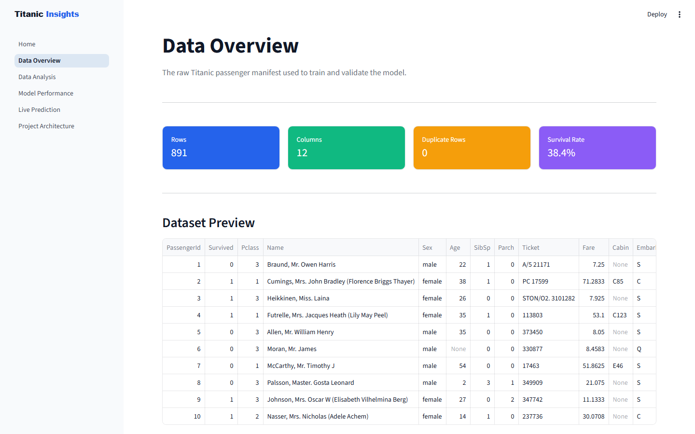
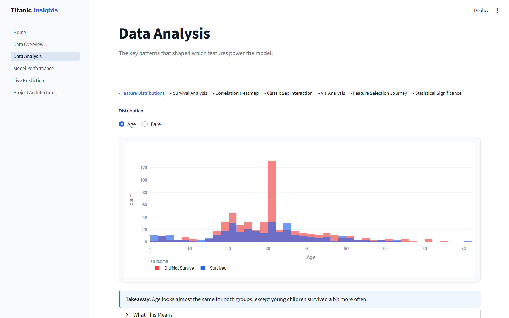
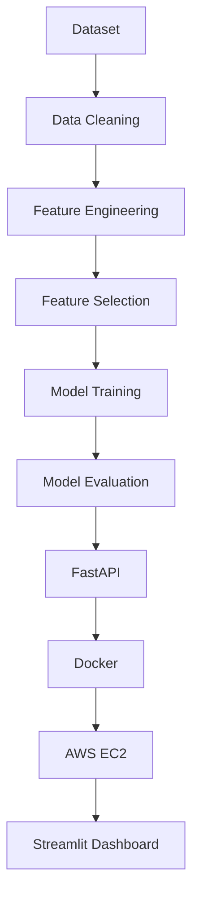
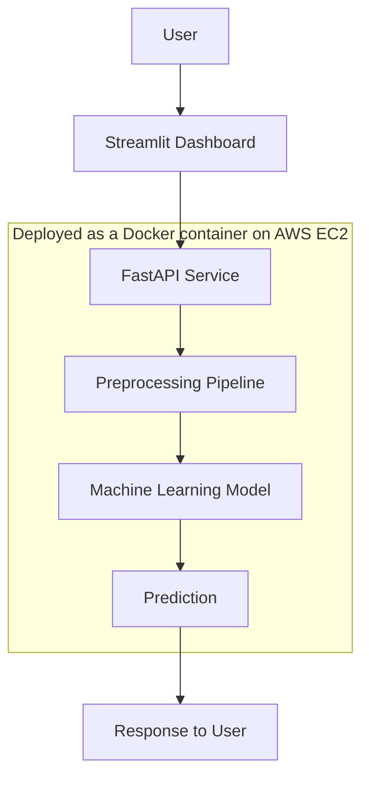

# Titanic Survival Prediction

An end-to-end machine learning system that predicts Titanic passenger survival, built to demonstrate a complete, production-style ML engineering workflow rather than a single notebook.

<p align="center">


</p>

<p align="center">
<a href="http://13.51.85.67:8501"></a>
<a href="http://13.51.85.67:8000/docs"></a>
</p>

> **Live Project:**
> - Dashboard: [http://13.51.85.67:8501](http://13.51.85.67:8501)
> - API Docs: [http://13.51.85.67:8000/docs](http://13.51.85.67:8000/docs)

---

## Project Overview

The Titanic dataset is a well-known problem: given a passenger's details, predict whether they survived. The prediction problem itself is simple. What this project focuses on is everything around it that a real ML system needs.

The dataset was chosen deliberately because it is small and well understood. That removes the need to prove the dataset is interesting, and lets the project focus entirely on engineering quality: leakage-safe preprocessing, evidence-based feature selection, a controlled comparison across multiple models, and a deployment path that actually runs in production.

The final application is a FastAPI service that serves predictions from a trained Logistic Regression model, paired with a Streamlit dashboard that walks through the data, the modeling decisions, and a live prediction tool. Both are containerized with Docker and deployed to AWS EC2.

## Key Features

- **End-to-end ML pipeline** — raw CSV to a deployed, versioned API
- **Leakage-safe preprocessing** — fit once on the training split, never refit at inference
- **Statistical feature engineering** — Family Size, Title, Cabin presence, log-transformed Fare
- **Evidence-based feature selection** — statistical testing, mutual information, and VIF cut 11 candidate features to 8
- **Controlled model comparison** — four models trained and scored under one identical protocol
- **Model evaluation** — ROC/AUC, confusion matrix, calibration, and permutation importance
- **Interactive Streamlit dashboard** — six pages covering data, analysis, model performance, and live prediction
- **Live prediction with explanations** — every prediction decomposes into signed feature contributions, no black box
- **FastAPI service** — validated request/response contracts, backward-compatible across a model swap
- **Docker containerization** — a single versioned image for the API
- **AWS EC2 deployment** — the containerized API and dashboard run on a live instance
- **Automated testing** — 76 tests across unit, integration, and end-to-end layers
- **Continuous integration** — every push rebuilds artifacts and re-validates them

## Dashboard Preview

<table>
<tr>
<td width="50%"><br><sub align="center">Home</sub></td>
<td width="50%"><br><sub>Data Overview</sub></td>
</tr>
<tr>
<td width="50%"><br><sub>Exploratory Data Analysis</sub></td>
<td width="50%"><br><sub>Model Performance</sub></td>
</tr>
<tr>
<td width="50%"><br><sub>Live Prediction</sub></td>
<td width="50%"><br><sub>System Architecture</sub></td>
</tr>
</table>

## Project Workflow



## Machine Learning Pipeline

1. **Data Cleaning** — impute missing `Age` and `Embarked` values using training-fold statistics only, so no information from the test split leaks into training.
2. **Feature Engineering** — derive `FamilySize` from siblings and parents aboard, extract `Title` from the passenger name, convert `Cabin` into a `HasCabin` flag, and log-transform the skewed `Fare` column.
3. **Feature Selection** — use statistical significance testing, mutual information, and variance inflation factor (VIF) analysis to cut the candidate set from 11 features to 8.
4. **Model Comparison** — train four models under an identical train/test split and cross-validation strategy, then compare them on accuracy, precision, recall, F1, and ROC-AUC.
5. **Model Evaluation** — inspect the confusion matrix, ROC curve, calibration, and feature importance of the selected model before shipping it.
6. **Deployment** — package the trained model and preprocessing pipeline into a FastAPI service, containerize it with Docker, and run it on AWS EC2.

## Dataset

| | |
|---|---|
| Source | Titanic passenger manifest (the standard Kaggle Titanic dataset) |
| Rows | 891 |
| Raw features | 11 (`Pclass`, `Sex`, `Age`, `SibSp`, `Parch`, `Fare`, `Embarked`, `Cabin`, `Name`, `Ticket`, `PassengerId`) |
| Target | `Survived` (binary: 0 = did not survive, 1 = survived) |
| Missing values | `Cabin` 77%, `Age` ~20%, `Embarked` under 1% |
| Class balance | About 62% did not survive, 38% survived |

## Exploratory Data Analysis

- **Sex is the strongest single predictor.** Women survived at a much higher rate than men.
- **Passenger class matters, and it interacts with sex.** First-class women survived at 97%, first-class men at only 37%. Neither feature alone explains this as well as the two together.
- **Fare is heavily right-skewed**, with a small number of passengers paying far more than the rest. This motivated a log transform before modeling.
- **Family-related columns overlap.** `SibSp`, `Parch`, and the derived `FamilySize` move together closely enough that VIF flagged them as effectively duplicate information.
- **Age on its own is a weak predictor.** Survivors and non-survivors have similar age distributions, aside from a small survival bump among young children.

## Feature Engineering

| Feature | How it's built | Why |
|---|---|---|
| `FamilySize` | `SibSp + Parch + 1` | Combines two overlapping columns into one interpretable signal |
| `Title` | Extracted from `Name` (Mr, Mrs, Miss, Master, Rare) | Captures sex, age, and social status in a single field |
| `HasCabin` | 1 if `Cabin` is recorded, else 0 | `Cabin` is 77% missing, but whether one was recorded at all still carries information |
| `Fare` (log-transformed) | `log1p(Fare)` | Corrects heavy right skew so a linear model can use it effectively |

**Final production feature set (8 features):** `Pclass`, `Sex`, `Age`, `Fare`, `Embarked`, `HasCabin`, `FamilySize`, `Title`.

## Feature Selection

The original candidate set had 11 features. The final set has 8. Every feature that was cut was removed on evidence, not intuition:

- **Statistical testing** checked whether each feature carried a real relationship with survival.
- **Mutual information** ranked features by how much predictive signal they actually contributed.
- **Multicollinearity (VIF)** found that `SibSp`, `Parch`, and `FamilySize` were perfectly collinear (VIF = infinite). Only `FamilySize` was kept.
- **Engineering review** weighed the remaining marginal features against the complexity they would add.

Full write-up: [`reports/stage3_feature_selection.md`](reports/stage3_feature_selection.md).

## Model Comparison

Four models, trained and evaluated under one identical protocol:

| Model | Accuracy | Precision | Recall | F1 | ROC-AUC | CV Mean (F1) | Train Time | Inference Latency |
|---|---|---|---|---|---|---|---|---|
| **Logistic Regression (selected)** | **0.832** | **0.760** | **0.826** | **0.792** | **0.865** | 0.769 | **0.03 s** | **0.06 ms** |
| Baseline Random Forest (tuned, 11 features) | 0.804 | 0.724 | 0.797 | 0.759 | 0.853 | **0.795** | 0.89 s | 0.25 ms |
| Gradient Boosting | 0.804 | 0.783 | 0.681 | 0.729 | 0.841 | 0.763 | 0.13 s | 0.03 ms |
| Random Forest (untuned, 8 features) | 0.788 | 0.718 | 0.739 | 0.729 | 0.839 | 0.751 | 0.65 s | 0.25 ms |

<div align="center">

</div>

Full methodology: [`reports/stage4_model_comparison.md`](reports/stage4_model_comparison.md).

## Why Logistic Regression?

- **Best on 4 of 5 test metrics** — accuracy, recall, F1, and ROC-AUC — against a baseline Random Forest that went through its own hyperparameter search. Logistic Regression used a fixed configuration.
- **No overfitting signature.** Its test F1 (0.792) does not drop below its train F1 (0.780). The Random Forest baseline, by comparison, scores 0.837 on training and drops to 0.759 on test.
- **About 30 times faster to train** than the tuned baseline, and roughly 4 times faster at inference.
- **Fully interpretable.** Every prediction decomposes into signed, per-feature coefficient contributions, so there is no need for a separate explainability layer.

## Model Evaluation

- **Confusion matrix** — on the held-out test set, the model produces more false positives than false negatives, consistent with the balanced class weighting used during training.
- **ROC curve** — all four models cluster closely (AUC 0.839 to 0.865); the gap alone would not have been a decisive signal, which is why multiple metrics were used together.
- **Calibration** — predicted probabilities track observed outcomes closely at the extremes, with mild overconfidence in the 0.3–0.5 range. Not significant enough to justify recalibrating on a 179-row test set.
- **Feature importance** — `Sex` and `Title` dominate both the coefficient view and permutation importance. `Pclass` ranks lower on permutation importance because its signal overlaps with `Fare` and `HasCabin`.
- **Production readiness** — the model and preprocessing pipeline are loaded once at process startup, never refit per request, and both are versioned artifacts checked for compatibility in CI.

## Technology Stack

| Category | Technology |
|---|---|
| Programming | Python 3.11 |
| Machine Learning | scikit-learn, pandas, NumPy, SciPy, statsmodels |
| Visualization | Plotly |
| Backend | FastAPI, Pydantic, Uvicorn |
| Dashboard | Streamlit |
| Containerization | Docker |
| Cloud | AWS EC2 |
| Testing | pytest, ruff, GitHub Actions |

## System Architecture



The preprocessing pipeline and the model are the same versioned artifacts used during training and evaluation. They are loaded once when the container starts and reused for every request, so inference never refits or reloads anything.

## Deployment

The API and dashboard are packaged into a Docker image and deployed on an AWS EC2 instance.

- **Docker** builds a single image containing the FastAPI service, the versioned model, and the preprocessing pipeline.
- **FastAPI** serves `/predict` and `/health` from inside the container.
- **AWS EC2** hosts the running container behind its public IP.
- **Container startup** loads the model and preprocessor once; no per-request reloading.
- **Prediction flow** — a request reaches the API, passes through the same preprocessing pipeline used in training, is scored by the model, and returns a structured JSON response.

Live instance: [http://13.51.85.67:8000](http://13.51.85.67:8000/docs) (API) and [http://13.51.85.67:8501](http://13.51.85.67:8501) (dashboard).

## Project Structure

```
Titanic-End-to-End/
├── analysis/          Reproducible stage scripts (data audit, model comparison)
├── api/               FastAPI service — schemas.py, main.py
├── artifacts/         Versioned preprocessing pipeline + feature schema
├── dashboard/         6-page Streamlit application
├── data/              Raw Titanic dataset
├── docs/              Diagrams and dashboard screenshots
├── model/             Trained model files and training scripts
├── notebooks/         EDA, model comparison, and evaluation notebooks
├── reports/           Stage-by-stage engineering write-ups
├── src/               Shared feature engineering (TitanicPreprocessor)
├── tests/             unit/, integration/, e2e/ — 76 tests
├── .github/workflows/ CI pipeline
└── Dockerfile
```

## Installation

```bash
# Clone the repository
git clone https://github.com/Udbhav748/Titanic-survival-analytics.git
cd Titanic-End-to-End

# Create and activate a virtual environment
python -m venv venv
source venv/bin/activate      # Windows: venv\Scripts\activate

# Install dependencies
pip install -r requirements-dev.txt
```

**Run the dashboard:**

```bash
streamlit run dashboard/Home.py
```

**Run the API:**

```bash
uvicorn api.main:app --reload
```

**Run with Docker:**

```bash
docker build -t titanic-api .
docker run -d -p 8000:8000 --name titanic-api-container titanic-api
```

## API Usage

**Request** — `POST /predict`

```json
{
  "pclass": 1,
  "sex": "female",
  "age": 29,
  "sibsp": 0,
  "parch": 0,
  "fare": 100,
  "embarked": "C",
  "has_cabin": true,
  "title": "Mrs"
}
```

**Response:**

```json
{
  "survived": true,
  "survival_probability": 0.9867
}
```

```bash
curl -X POST http://13.51.85.67:8000/predict \
  -H "Content-Type: application/json" \
  -d '{"pclass": 1, "sex": "female", "age": 29, "sibsp": 0, "parch": 0, "fare": 100, "embarked": "C", "has_cabin": true, "title": "Mrs"}'
```

Interactive docs are available at `/docs` once the API is running, or try the [live instance](http://13.51.85.67:8000/docs) directly.

## Results

- **Final model:** Logistic Regression, 8 production features
- **Test accuracy:** 83.2%
- **ROC-AUC:** 0.865
- **Generalization:** no overfitting signature — test performance matches training performance
- **Deployment:** containerized with Docker, running on AWS EC2
- **Testing:** 76 automated tests passing, 100% coverage on the core preprocessing module

## Future Improvements

- Add monitoring for prediction latency and API error rates in production
- Build an automated retraining pipeline instead of a manual notebook-driven process
- Revisit the schema with a larger, non-Kaggle passenger dataset
- Automate the EC2 deployment step, currently run by hand
- Move to continuous deployment once the retraining pipeline exists

## License

[MIT](LICENSE)

