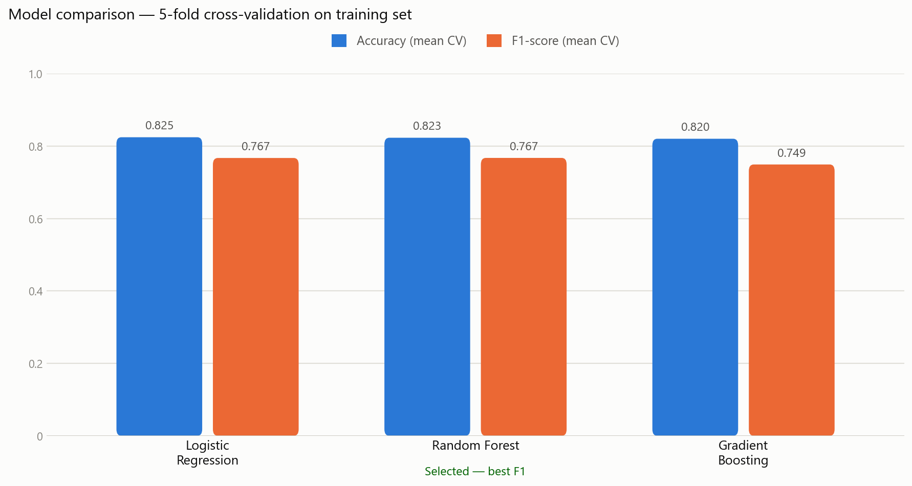
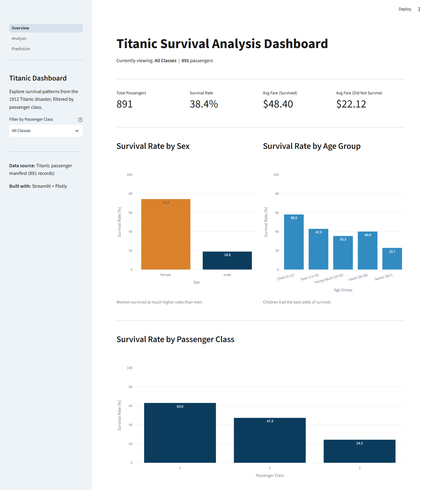
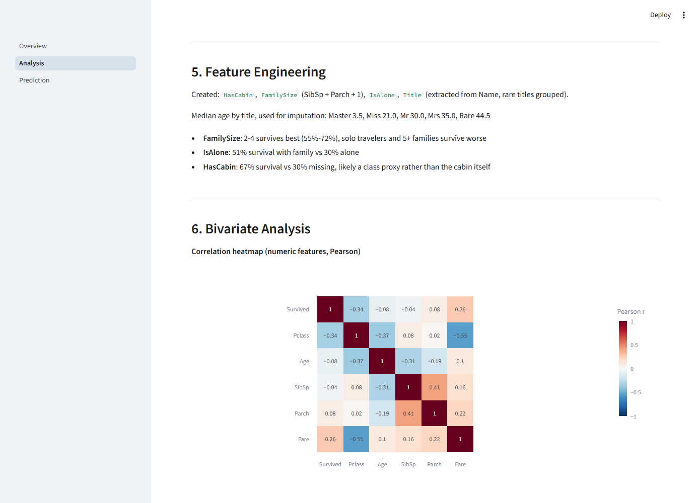
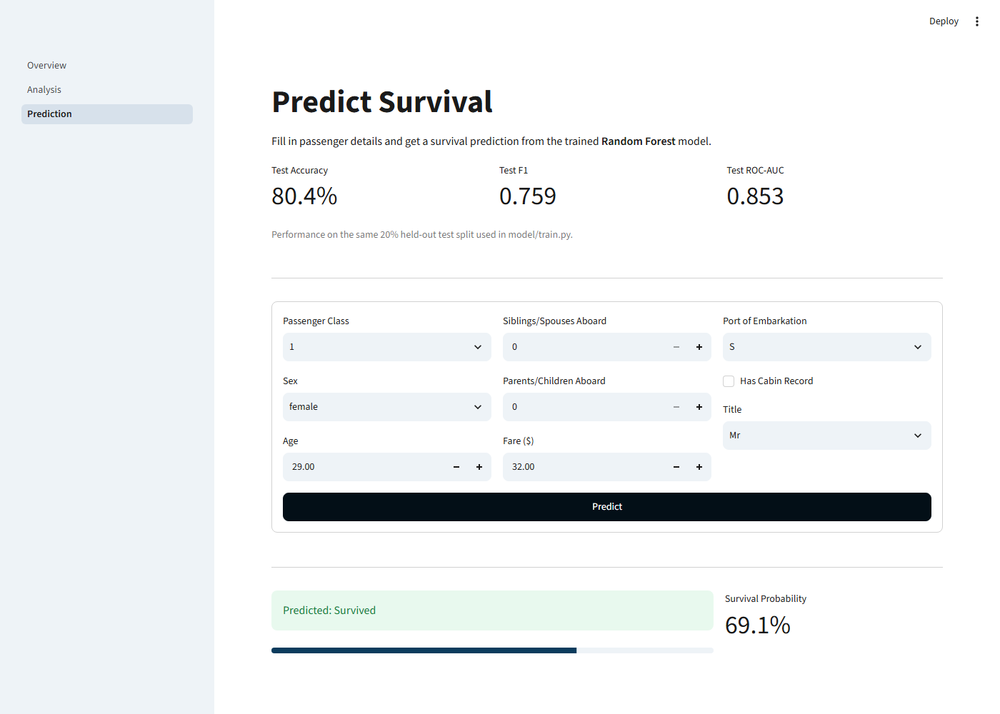
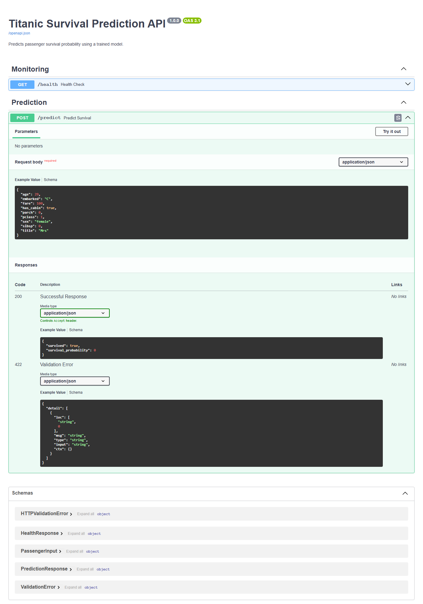

# Titanic Survival Prediction — End-to-End ML Project

An end-to-end machine learning project: statistical analysis, an interactive dashboard, a tuned classifier, a live API, and a cloud deployment — all built around one dataset, one connected pipeline.

**Live Demo:**
- API Docs: `http://13.51.85.67:8000/docs`
- Dashboard: `http://13.51.85.67:8501`

---

## Tech Stack

Python · pandas · scikit-learn · SciPy · Streamlit · Plotly · FastAPI · Pydantic · Docker · AWS EC2

---

## Phase 1 — Statistical Analysis (EDA)

- **Dataset (891 passengers, 12 columns)**: Big enough to find real patterns, but small enough that unusual cases still matter.
- **Missing data**: Age had some missing values, so I filled them with the middle value. Cabin had too many missing values to fill, but the missing data itself was useful. Embarked had only 2 missing values, so I filled them with the most common port.
- **Fare**: Most people paid low fares, while a few paid very high fares, so I used a log transform to make the data more balanced.
- **Age**: The ages were fairly balanced, so using the median was a good choice.
- **Outliers**: I kept unusual values because they were real passengers, not mistakes.
- **Correlation**: It showed expected relationships, like higher-class passengers usually paying higher fares.
- **Survival rates**: I compared survival percentages for different groups like men vs. women and different passenger classes.
- **Embarked**: At first, the boarding port seemed important, but it was actually because different ports had different mixes of passenger classes.
- **Hypothesis test (p < 0.001)**: The fare difference between survivors and non-survivors was almost certainly real, not due to chance.
- **Welch's t-test**: I used this because the two groups had different levels of variation, making the results more accurate.

---

## Phase 2 — Interactive Dashboard (Streamlit)

- Converted top insights into a live, filterable dashboard
- **KPI row:** total passengers, survival rate, avg fare by outcome
- **1 filter:** Passenger Class (selectbox) — chosen since it had the clearest effect on survival
- **3 Plotly charts:** survival by Sex, by Age Group, and a Fare comparison — each with a plain-English insight caption
- Later expanded into **3 pages**: Overview, full live Analysis, and a Prediction page (loads the same `model.pkl` as the API)

---

## Phase 3 — Machine Learning Model

My goal was to predict whether a passenger survived, using a proper, defensible approach — not just training one model and stopping.

**Feature engineering:**
- Extracted `Title` (Mr, Mrs, Miss, Master) from the `Name` column — also improved `Age` imputation, using the median age per title group instead of one overall average
- Created `FamilySize` (SibSp + Parch + 1) and an `IsAlone` flag
- Converted the mostly-missing `Cabin` column into a simple `HasCabin` yes/no flag instead of dropping it

Saved the result as `data/train_transformed.csv`. Summary of what changed vs. the raw CSV:
- Dropped `PassengerId`, `Name`, `Ticket` — identifiers/free text with no direct signal
- Dropped `Cabin`, added `HasCabin` flag — 77% missing, but *whether* it's missing still carries signal
- Added `Title` (from `Name`) — packs in age/sex/status; also rare titles merged
- Added `FamilySize` and `IsAlone` (from `SibSp` + `Parch`) — solo travelers and large families both survived less
- 177 people had no `Age` listed. Instead of guessing one age for everyone, I used the typical age for their `Title` (like Mr, Mrs, Master) — so a young boy ("Master") doesn't end up with an adult's age

**Preprocessing:**
- Filled missing values — median for numeric columns, most frequent for categorical
- One-hot encoded categorical columns (Sex, Embarked, Pclass) so the model can read them
- Scaled numeric columns
- Bundled all of this into a single `scikit-learn Pipeline`, so the exact same steps run automatically every time — in the notebook, dashboard, or API

**Model selection:**
- Split data 80/20, using a stratified split to keep the same survival ratio in both parts
- Compared 3 models — Logistic Regression, Random Forest, and Gradient Boosting — using 5-fold cross-validation
- Random Forest performed best, so I selected it



| Model | Mean CV Accuracy | Mean CV F1-score |
|---|---|---|
| Logistic Regression | 0.825 | 0.767 |
| Random Forest | 0.823 | 0.767 |
| Gradient Boosting | 0.820 | 0.749 |

Accuracy was nearly identical across all three, but Random Forest and Logistic Regression edged out Gradient Boosting on F1 — and Random Forest won that tiebreak, which is why it was selected.

**Tuning:**
- Used `RandomizedSearchCV` to automatically find better settings, instead of guessing fixed numbers

**Fixing a real weakness:**
- Noticed my model was missing a lot of real survivors, even though it looked accurate overall
- Traced this to class imbalance in the data (~62% did not survive, ~38% did)
- Fixed it using `class_weight="balanced"`, which meaningfully improved recall

**Final results:** Accuracy 80.5%, Precision 0.72, Recall 0.80, F1-score 0.76, ROC-AUC 0.85

Confusion matrix:

|  | Predicted: No | Predicted: Yes |
|---|---|---|
| Actual: No | 89 | 21 |
| Actual: Yes | 14 | 55 |

Saved the entire pipeline as `model.pkl` using `joblib`, so it works identically wherever it's loaded.

---

## Phase 4 — FastAPI Service

I wrapped my trained model in a FastAPI service so it can be used outside the notebook, by any program.

- Built a `PassengerInput` Pydantic schema — defines exactly what valid input looks like; bad or missing data is automatically rejected (422 error)
- Two endpoints: `/health` (checks the service and model are working) and `/predict` (returns a survival prediction with probability)
- Model loaded once when the API starts, not on every request — keeps things fast
- Added global exception handling, so no raw errors are ever leaked back to whoever calls the API
- Tested everything through the auto-generated Swagger UI at `/docs`, sending real requests and confirming correct responses

---

## Phase 5 — Docker

I packaged my API using Docker so it runs the same way on any machine.

- Started from a lightweight `python:3.11-slim` base image
- Installed dependencies before copying my code, so rebuilds are faster (Docker reuses cached layers)
- Used a separate, slimmer `requirements-api.txt` with only API-specific packages, instead of my full dev requirements — kept the image small (712MB)
- Ran the container as a non-root user, for security
- Made sure it's reachable from outside the container by binding to `0.0.0.0:8000`, not `127.0.0.1`
- Tested it using curl and Python's requests library

**Basic commands I used:**

```bash
docker build -t titanic-api .                                        # build the image
docker run -d -p 8000:8000 --name titanic-api-container titanic-api  # run it as a container
docker ps                                                             # check it's running
docker logs titanic-api-container --tail 30                          # view its logs
docker rm -f titanic-api-container                                   # remove it, to rebuild fresh
```

---

## Phase 6 — GitHub

I used Git and GitHub to save my project properly and track every change.

- Pushed the full project with a clean structure, README, and requirements file
- For bigger changes, I used branches and pull requests instead of editing my main project directly
- Found and fixed a real bug — my git remote was pointing to an old repository — caught it using `git remote -v`

**Basic commands I used:**

```bash
git init                          # start tracking my project with Git
git status                        # check what's changed
git add .                         # stage my files
git commit -m "message"           # save a snapshot with a note
git push                          # send my changes to GitHub
git remote -v                     # check which repo I'm connected to
git pull origin main              # get the latest code from GitHub
git checkout -b branch-name       # create and switch to a new branch
```

---

## Phase 7 — AWS EC2 Deployment (Stretch Goal)

I deployed my project to a live cloud server so it's not just running on my own laptop.

- Launched a free-tier `t3.micro` Ubuntu instance
- Created a key pair file for secure SSH login, no passwords needed
- Opened a firewall rule (security group) for ports 22, 8000, and 8501
- Installed Docker on the server, and cloned my project from GitHub
- Ran the API inside Docker, and ran the dashboard directly on the server using a Python virtual environment with `nohup`, so it keeps running after I disconnect
- Confirmed both were genuinely live by opening them in my own browser, from my own computer, not just checking inside the server

**Basic commands I used:**

```bash
ssh -i "titanic-key.pem" ubuntu@<my-instance-address>   # connect to my server
sudo apt update && sudo apt install -y docker.io        # install Docker
git clone <my-repo-url>                                 # copy my project onto the server
docker build -t titanic-api .                           # same build command as locally
docker run -d -p 8000:8000 --name titanic-api-container titanic-api
```

---

## Screenshots

| Dashboard | Analysis |
|---|---|
|  |  |

| Prediction | FastAPI Docs |
|---|---|
|  |  |

---

## Key Techniques Used

`Missing value imputation` · `Log transformation` · `IQR outlier detection` · `Hypothesis testing (t-test, Levene's)` · `Correlation analysis` · `Feature engineering` · `One-hot encoding` · `sklearn Pipeline` · `Stratified split` · `Cross-validation` · `RandomizedSearchCV` · `Class imbalance handling` · `REST API design` · `Data validation (Pydantic)` · `Containerization (Docker)` · `Cloud deployment (EC2)` · `Version control (Git/GitHub)`

---

## Project Structure

```
Titanic-End-to-End/
├── data/train.csv, train_transformed.csv
├── notebooks/Udbhav_Statistical_Analysis.ipynb
├── dashboard/
│   ├── Overview.py
│   └── pages/1_Analysis.py, 2_Prediction.py
├── model/train.py, model.pkl
├── api/main.py, schemas.py
├── Dockerfile
├── requirements.txt, requirements-api.txt
└── README.md
```

---

## How to Run

```bash
# Local — API
uvicorn api.main:app --reload

# Local — Dashboard
streamlit run dashboard/Overview.py

# Docker
docker build -t titanic-api .
docker run -d -p 8000:8000 --name titanic-api-container titanic-api
```

---

## Future Improvements

- Try XGBoost / LightGBM
- Automated tests for API and pipeline
- CI/CD pipeline
- Elastic IP + systemd/restart policies for full reboot persistence
